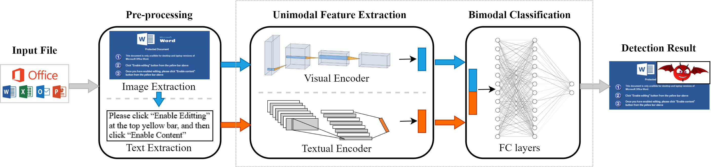

# DitDetector

## Background 
DitDetector leverages bimodal learning based on deceptive images and text for macro malware detection.
Specifically, we extract preview images of documents based on an image export SDK of Oracle and 
extract textual information from preview images based on an open-source OCR engine. 
And bimodal model of DitDetector contains a visual encoder, a textual encoder, and a forward neural 
network, which learns based on the joint representation of the two encoders' outputs.

DitDetector can detect the malicious Microsoft Office documents with deceptive information, but cannot
detect the malicious MS documents that only contains VBA codes.




## Install

**Oracle Outside in Technology (OIT)**  -  a tool statically export the preview images from the MS Office 
documents, download and related information in the Oracle 
[blog](https://blogs.oracle.com/fusionmiddlewaresupport/post/oracle-outside-in-technology-855-has-been-released).
We have offered OIT at version of 8.5.4 in directory `./src/oit_linux_8.5.4`.
Before next step, please make demo:
```commandline
cd ./src/oit_linux.8.5.4 && bash makedemo.sh  && sudo chmod 777 sdk/demo/exsimple
```

**[Tesseract](https://tesseract-ocr.github.io/tessdoc/Installation.html)** - an open source text recognition 
(OCR) engine, we install it on CentOS

```commandline
yum install epel-release -y
yum install tesseract -y
```


**Create the environment through Anaconda**
```commandline
conda env create -f environment.yaml
```
You should change the prefix of conda environment in the yaml file.


**unzip the test data**: The test data contains malicious samples, so we have compressed the test data by zip 
encryption. Before running DitDetector, please use the *password* `ditdetector` to unzip the `ms_files.zip` archive.
```commandline
cd ./data/test_data && unzip -P ditdetector -x ms_files.zip -d ./
```


## Code Structure
The proposed detector code is in `./src`, some pre-trained models and test data are in `./data`.

Modules:
- Textual encoder `./src/TextCNN`
- Visual encoder `./src/MobileNetV3`
- Bimodal detector `./src/BiModal`

End-to-end tool:
- DitDetector `./src/DitDetector`


## Usage
This is an end-to-end detector, which take input as the Microsoft (MS) Office documents and output 
a label if the sample is malicious or benign (i.e., '1' for malice and '0' for benign).
```commandline
cd ./src/DitDetector
python ditDetector.py  -m ur_ms_files_dir  -e ur_export_img_dir
```

The `ur_ms_files_dir` is the directory to store the MS documents to detect, the default value is 
`./data/test_data/ms_files/`.
The `ur_export_img_dir` is the directory to cache the exported images by Oracle Outside in 
Technology (OIT), and the default value is `./data/test_data/export_img/`.


*Note: If you encounter the error message shown below when parsing the MS Office files with the OIT, use the 
`export GDFONTPATH=your_font_folder_path` to specify to the font folder.*
```commandline
EXRunExport() failed: No valid fonts found (0x0B03)
```


The workflow of DitDetector is as follows.
- Step 1: export the preview images of MS Office documents in `ur_ms_files_dir` by `exsimple`
in Oracle OIT, and cache the exported images into the directory `ur_export_img_dir`.
- Step 2: extract the textual information from the preview images via `Tesseract`, an open-source 
Optical Character Recognition (OCR) tool, clean the textual information and save them into a 
temp file `./data/test_data/docText.csv`.
- Step 3: generate the visual and textual feature representations via encoders (i.e., `TextCNN` 
and `MobileNetV3`).
- Step 4: concatenate these two modalities of feature representations as the bi-modal representations 
and feed them into the `biModal` to detect.
- Step 5: output the final decision whether the input document is malicious (i.e., `1`) or benign (i.e., `0`).

## Test Environment
- Intel(R) Xeon(R) CPU E5-2630 v4 (2.20GHz and 40 cores)
- NVIDIA Tesla P100 (12GB)
- CentOS 7.9.2009
- Python 3.6.13
- conda 4.14.0

## Execution Time Estimate 
DitDetector execution time is flexible. In fact, the most time-consuming part is the preprocessing module, including OIT exporting preview images and OCR extracting text. Especially the OCR module, the more text in the document preview images, the more time OCR takes.
In addition, we give time estimates containing the loading time of each model, and the actual sample inference time should be shorter.
We detect 20 MS office documents with an end-to-end execution time of about 130s, and if we exclude both OCR and OIT modules, the remaining process takes only 13.71s.
